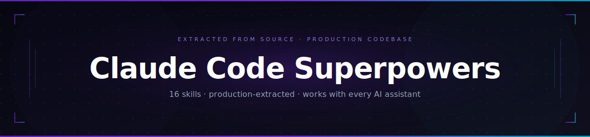

# Claude Code Superpowers

<p align="center">
  
</p>

<p align="center">
  
  
  
  
</p>

<p align="center"><em>16 production-extracted patterns. Every one validated. Every one transferable.</em></p>

<p align="center">
  
  
  
</p>

---

<p align="center">
  
</p>

---

## Install in 30 seconds

```bash
# Claude Code — all 16 skills
cp -r skills/ .claude/skills/

# Cursor
cp -r skills/ .cursor/skills/

# Gemini CLI — add to GEMINI.md
echo "@./skills/error-handling/SKILL.md" >> GEMINI.md
```

Skills load automatically when your prompt matches a trigger keyword. No invocation needed.


Most AI skills collections are lists. This one is a curriculum — 16 patterns extracted directly from Claude Code's actual source code, each tested against the six-test standard, each verified to work in a codebase the author has never seen.

I had Claude Code's source. I read it end to end. These are the patterns worth keeping — not everything, just the ones that showed up repeatedly, had a real reason to exist, and changed how I thought about the problems they address.

The code examples are TypeScript. The principles they illustrate are not: typed errors, immutable state reducers, schema-as-source-of-truth, and per-call concurrency declarations apply in any typed language. A Python or Go developer will need to mentally translate the syntax; the reasoning transfers directly.

If you want to know what makes the source worth reading, [skip ahead to the three things that surprised me most](#three-things-i-noticed-while-reading-the-source).

---

## How it works

A skill is a markdown file with a `description` field. For agents that support keyword triggers (Claude Code, Cursor), skills load automatically when your prompt matches — write "add error handling to this function" and the error-handling skill is already there. For others (Gemini CLI, Codex), skills are loaded once at session start from your agent's context file. Either way, no invocation needed.

No build step. No runtime configuration. Copy skills into your agent's directory and they become part of how your assistant thinks.

---

## How to load

<details open>
<summary><strong>Claude Code</strong></summary>

```bash
# All 16 skills
cp -r skills/ .claude/skills/

# Specific skills only
cp skills/error-handling/SKILL.md .claude/skills/
cp skills/types-and-interfaces/SKILL.md .claude/skills/
```
</details>

<details>
<summary><strong>Cursor</strong></summary>

```bash
cp -r skills/ .cursor/skills/
# or use the .cursor-plugin/ manifest
```
</details>

<details>
<summary><strong>Gemini CLI</strong></summary>

```bash
# Add each skill you want to GEMINI.md
echo "@./skills/error-handling/SKILL.md" >> GEMINI.md
echo "@./skills/types-and-interfaces/SKILL.md" >> GEMINI.md
```
</details>

<details>
<summary><strong>Codex</strong></summary>

Symlink skills into `~/.agents/skills/` — see [`.codex/INSTALL.md`](.codex/INSTALL.md)
</details>

<details>
<summary><strong>OpenCode</strong></summary>

Add plugin to `opencode.json` — see [`.opencode/INSTALL.md`](.opencode/INSTALL.md)
</details>

---

## The 16 skills

Skills are ordered from foundational to advanced. If you're new here, start with `domain-model`, `error-handling`, and `types-and-interfaces` — they're prerequisites for most of the others.

| Skill | Loads when | What it teaches |
|---|---|---|
| `domain-model` | Building any new capability, command, or feature | Six-concept model for capability-driven systems and how they compose |
| `error-handling` | Writing any capability that can fail | Throw typed errors; the framework formats them for the consumer |
| `types-and-interfaces` | Designing new types or data shapes | Schema as single source of truth; discriminated unions for multi-shape outputs |
| `tool-definition` | Defining a new typed capability | Schema-first design: one definition drives types, validation, and API docs simultaneously |
| `permission-system` | Writing a capability with side effects | Permissions declared on the capability, evaluated by the framework before execution |
| `async-concurrency` | Writing read-only or long-running capabilities | Per-call concurrency declarations, cancellation propagation, parallel I/O |
| `build-tool-factory` | Creating a new capability object | Factory pattern with safe defaults — only override what your capability actually needs |
| `module-organisation` | Deciding where new code lives | Organise by responsibility boundary, not by feature |
| `naming-conventions` | Naming files, types, functions, or variables | Names encode role: verb prefixes, boolean prefixes, callback prefixes, constant casing |
| `hot-paths` | Writing startup code or frequently-called functions | Deferred schema construction, memoised computation, parallel initialisation |
| `state-management` | Reading or writing shared state from a tool or task | Immutable state with atomic reducer updates — spread at every level, return `prev` unchanged as a no-op signal |
| `task-system` | Spawning long-running background work | Disk-backed background tasks with explicit lifecycle |
| `system-boundaries` | Integrating an external API, process, or service | Each external system gets a boundary module that owns its failure modes |
| `observability` | Adding logging or instrumentation | PII-safe structured event logging, duration tracking, telemetry vs debug distinction |
| `skill-and-command-dispatch` | Writing a slash command or skill | Prompt injection vs. local execution; inline vs. forked context isolation |
| `creating-skills` | Authoring a new SKILL.md from a codebase pattern | The two-layer structure, the real-code requirement, and the six quality tests |

The last skill is the most distinctive thing about this repo. `creating-skills` teaches you to do exactly what I did here — read a codebase, find the patterns worth keeping, and package them so your AI assistant learns them. Point it at any well-engineered codebase you have access to. No other skills collection teaches you to build your own.

---

## Three things I noticed while reading the source

These aren't features — they're patterns I kept seeing in file after file that I'd never seen enforced so consistently elsewhere.

**The codebase never defines a type and a validator separately.**
Every tool input has a single schema definition. The TypeScript type is derived from it with `z.infer<>`. The LLM's JSON schema is generated from it. Change one thing, everything updates. Before I saw this, I thought the tradeoff was inconvenience for safety. After seeing it applied at scale, I think the separate-definition approach is just technical debt waiting to happen.

```typescript
const schema = () => z.object({ file_path: z.string() })
type Input = z.infer<ReturnType<typeof schema>>  // derived — never written twice
```

**No tool returns an error shape. Every failure is thrown.**
The common pattern I'd seen everywhere was `{ success: false, error: '...' }`. Claude Code doesn't do this. Tools throw typed errors. The framework catches them and formats them for the LLM. The tool has one job: do the work or throw. The same principle applies in any language.

```typescript
// TypeScript
async call(args): Promise<{ data: string }> {
  if (cancelled) throw new CancelledError()
  return { data: await doWork(args) }
}
```
```python
# Python — same principle
async def call(self, args: Args) -> dict:
    if cancelled:
        raise CancelledError()
    return {"data": await do_work(args)}
```

**Concurrency safety is never a constant. It's evaluated per call.**
I'd assumed concurrency was a per-tool decision — this tool is safe, that one isn't. Claude Code decides it per invocation. The same bash tool that's safe for `git status` is not safe for `npm install`. Declaring it statically would be wrong for half the calls.

```typescript
isConcurrencySafe(input) {
  return isReadOperation(input.command)  // same tool, different answer per input
}
```

---

## How this compares

| | Prompt engineering | System prompts | Cursor Rules | **These skills** |
|---|---|---|---|---|
| Persistent across sessions | ❌ | ✅ | ✅ | ✅ |
| Loads only when relevant | ❌ | ❌ | ❌ | ✅ |
| Backed by real production code | ❌ | ❌ | ❌ | ✅ |
| Teaches extraction methodology | ❌ | ❌ | ❌ | ✅ |
| Works across multiple agents | ❌ | ❌ | ❌ | ✅ |
| Zero config | ✅ | ✅ | ✅ | ✅ |

---

## How each skill is structured

Every skill uses the two-layer format: a generic principle that works in any codebase (sections 1, 3, 5, 6, 7) layered over real extracted source code that grounds it (section 4). The generic sections never reference the source codebase — they stand alone. The source section never contains invented examples — every block traces to a real file.

The eight sections, in order:

1. **The pattern** — the generic principle, explained without assuming knowledge of the source codebase
2. **Why this matters** — what breaks for a user if this pattern isn't followed
3. **How to apply it** — numbered steps
4. **In the source** — real code extracted from the source with `// Source: file/path` references
5. **Apply it to your code** — before block (realistic problem) and after block (every change annotated with `// WHY:`)
6. **Signals that you need this pattern** — concrete triggers
7. **Signals that you're over-applying it** — when the simpler alternative is better
8. **Works with** — related skills

Before a skill ships, it must pass the six-test standard: the stranger test (can someone who's never seen the source codebase use section 1 on their own project?), the trigger test, the real code test, the before/after test, the over-application test, and the domain connection test. A skill that fails any one of them is rewritten, not shipped.

You can read any SKILL.md directly as a standalone engineering reference — no AI tooling required.

---

## Before you read the skills

[`docs/REFERENCE.md`](docs/REFERENCE.md) is the foundational document — domain model, architecture overview, and vocabulary for the six concepts that appear across all skills. Read it once and the individual skills will make immediate sense. You can skip it and jump straight to a skill, but you'll hit undefined terms.

---

## Contributing

The best contributions to this repo are patterns from other well-engineered codebases. If you've spent time reading a production codebase and found something that keeps showing up — a way of handling errors, a module structure that scales, a concurrency pattern that prevents a class of bugs — that belongs here.

See `CONTRIBUTING.md` for the skill structure, the six validation tests, and the PR checklist. The short version: real source code only, no invented examples, and a description that names when to load the skill rather than summarising what it does.

The best way to contribute a new skill set: use the `creating-skills` meta-skill to extract patterns from any well-engineered codebase you have access to, then open a PR with the output.

---

<p align="center">
  <a href="https://github.com/TechyMT/claude-code-superpowers/stargazers">⭐ Star this repo if it changed how you think about AI coding agents</a>
</p>
